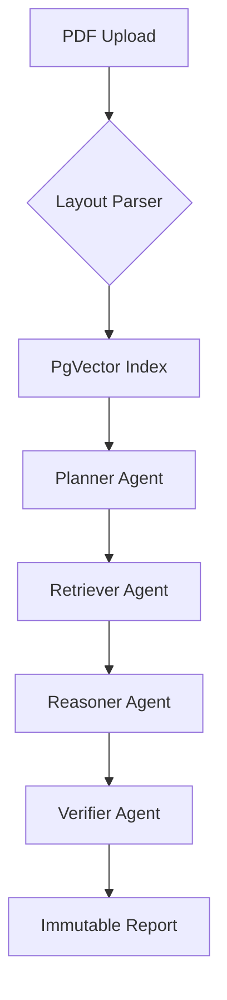
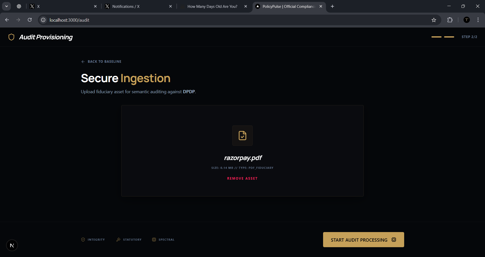
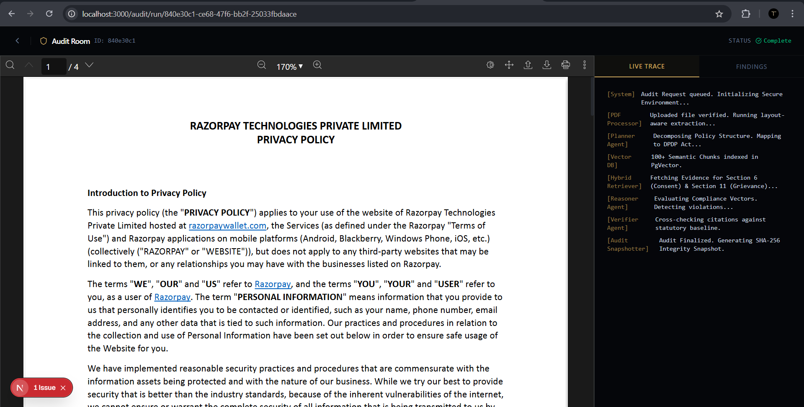
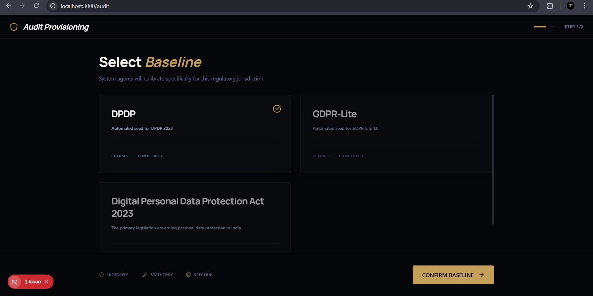

# DPDP Audit Engine
Automated privacy compliance. Fast. Deterministic. Traceable.

[Live Demo](https://company-legal-audit.vercel.app/)

## Problem
Reading 50-page privacy policies to check for DPDP compliance is a manual nightmare. It’s slow, expensive, and leaves no audit trail.

## Solution
A 4-agent RAG pipeline that audits documents against regulatory frameworks with cryptographic proof.
- **Layout-Aware**: Parses headers and hierarchy, not just raw text.
- **Hybrid RAG**: `PgVector` + Keyword search for high-precision retrieval.
- **Agentic Reasoning**: Planner, Retriever, Reasoner, and a Safety Verifier.
- **Immutable Proof**: SHA-256 hashes for every evidence snippet.

## Workflow

### Agentic Pipeline
- **Planner**: Maps regulatory requirements to the specific document context.
- **Retriever**: Executes hybrid searches to pull exact evidence snippets.
- **Reasoner**: Analyzes findings against laws and assigns risk scores.
- **Verifier**: Acts as a safety gate to prevent hallucinations and verify citations.

## Tech Stack
- **Backend**: FastAPI + SQLAlchemy 2.0
- **Database**: PostgreSQL (PgVector)
- **AI**: OpenAI (GPT-4o-mini)
- **Extraction**: PyMuPDF

## Demo
| Ingestion Pipeline | Agent Reasoning | Compliance Report |
| :--- | :--- | :--- |
|  |  |  |
| *Parsing hierarchy* | *4-agent execution trace* | *Final risk baseline* |

## Setup
1. **Env**: `cp .env.example .env` (Add OpenAI keys + DB URL)
2. **Install**: `pip install -r requirements.txt`
3. **Run**: `uvicorn app.main:app --reload`

## Misc
- **Laws-as-Data**: Seed frameworks from `/compliance` JSONs.
- **Audit Defensibility**: Reports are frozen with a cryptographic fingerprint.
- **Health**: Nano-second tracing for every agent operation.